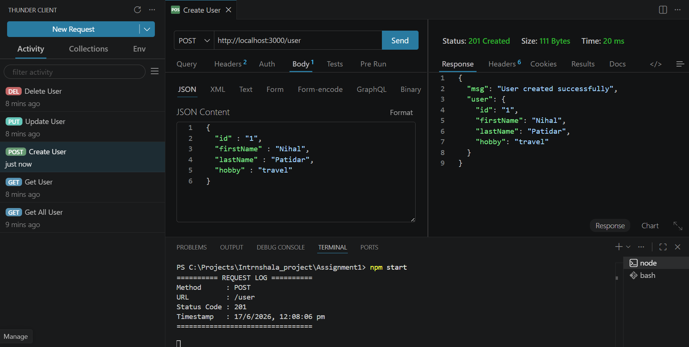
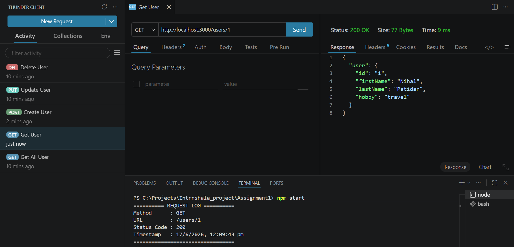
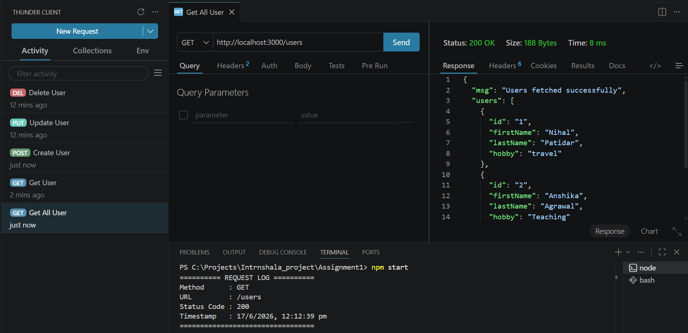
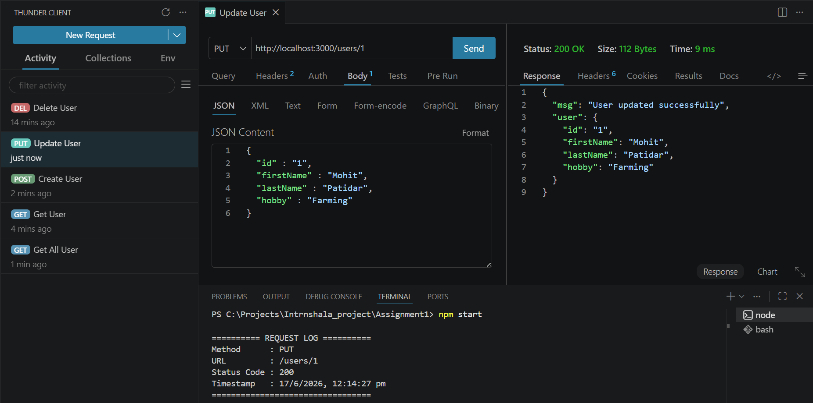
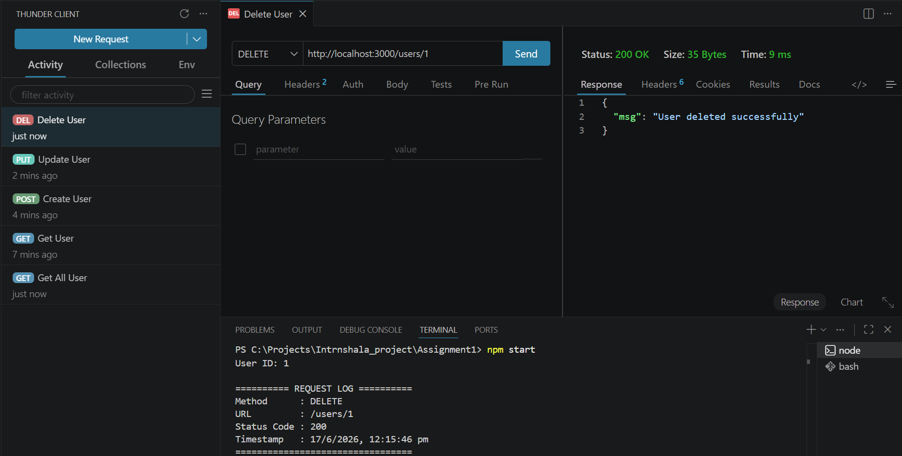
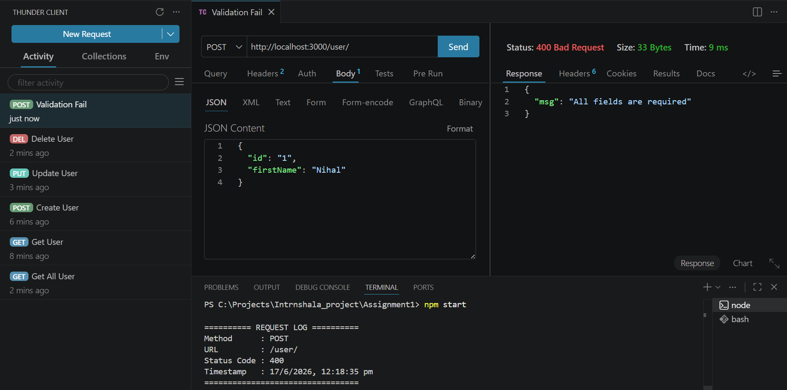
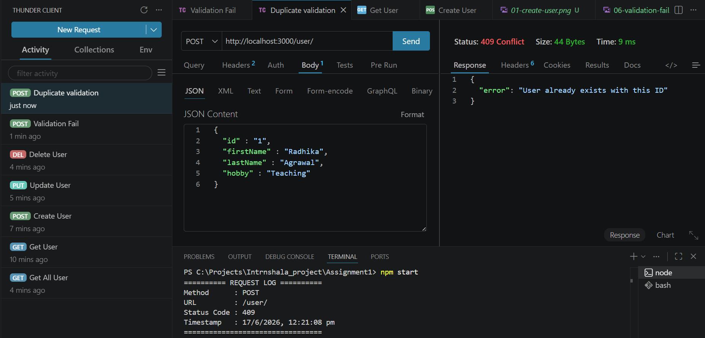
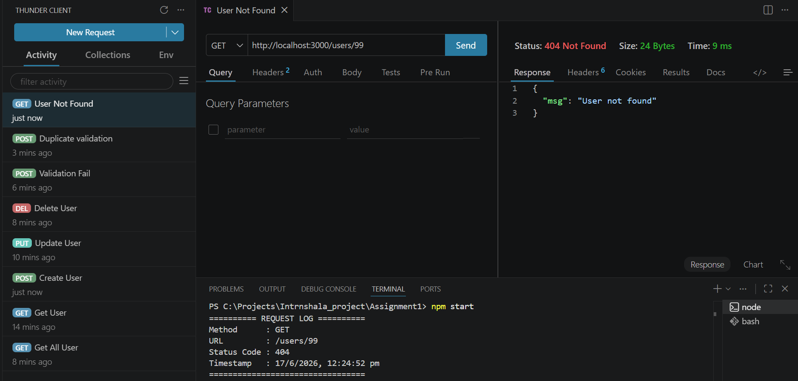
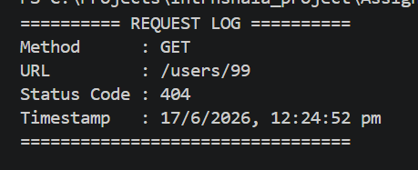

# RESTful API using Node.js and Express

## Overview

This project is a simple RESTful API built using **Node.js** and **Express.js** for managing users. The API demonstrates the use of:

- REST API routing
- HTTP methods (GET, POST, PUT, DELETE)
- Middleware
- Request validation
- Error handling
- Appropriate HTTP status codes
- In-memory data storage

---

## Project Structure

```text
ASSIGNMENT1/
│
├── controller/
│   └── userController.js
│
├── screenshots/
│   ├── 01-create-user.png
│   ├── 02-get-user.png
│   ├── 03-get-all-user.png
│   ├── 04-update-user-detail.png
│   ├── 05-delete-user.png
│   ├── 06-validation-fail.png
│   ├── 07-duplicate-id-validation.png
│   ├── 08-user-not-found.png
│   └── 09-logger.png
│
├── middleware.js
├── routes.js
├── server.js
├── users.js
├── package.json
├── package-lock.json
└── README.md
```

---

## Installation

### Clone Repository

```bash
git clone https://github.com/nihal-patidar/backend_api_assignment.git
```

### Install Dependencies

```bash
npm install
```

### Start Server

```bash
node server.js
```

Server will run on:

```text
http://localhost:3000
```

---

## User Object Structure

```json
{
  "id": "1",
  "firstName": "Nihal",
  "lastName": "Patidar",
  "hobby": "Teaching"
}
```

---

## API Endpoints

### Create User

```http
POST /user
```

Request Body:

```json
{
  "id": "1",
  "firstName": "Nihal",
  "lastName": "Patidar",
  "hobby": "Teaching"
}
```

Response:

```http
201 Created
```

---

### Get All Users

```http
GET /users
```

Response:

```http
200 OK
```

---

### Get User By ID

```http
GET /users/:id
```

Response:

```http
200 OK
```

or

```http
404 Not Found
```

---

### Update User

```http
PUT /users/:id
```

Request Body:

```json
{
  "id": "1",
  "firstName": "Nihal",
  "lastName": "Sharma",
  "hobby": "Development"
}
```

Response:

```http
200 OK
```

---

### Delete User

```http
DELETE /users/:id
```

Response:

```http
200 OK
```

---

## Middleware

### Logger Middleware

Logs:

- HTTP Method
- Request URL
- Response Status Code
- Timestamp

### Validation Middleware

Validates required fields:

- id
- firstName
- lastName
- hobby

Returns:

```http
400 Bad Request
```

if any field is missing.

---

## Error Handling

The API handles the following errors:

### Validation Error

```http
400 Bad Request
```

When required fields are missing.

### Duplicate User ID

```http
409 Conflict
```

When a user with the same ID already exists.

### User Not Found

```http
404 Not Found
```

When a requested user does not exist.

---

## HTTP Status Codes Used

| Status Code | Description |
|------------|-------------|
| 200 | Request Successful |
| 201 | User Created Successfully |
| 400 | Validation Failed |
| 404 | User Not Found |
| 409 | Duplicate User ID |

---

# API Testing Screenshots

## 1. Create User



---

## 2. Get User By ID



---

## 3. Get All Users



---

## 4. Update User



---

## 5. Delete User



---

## 6. Validation Failure



---

## 7. Duplicate ID Validation



---

## 8. User Not Found



---

## 9. Logger Middleware Output



---

## Author

**Nihal Patidar**
---